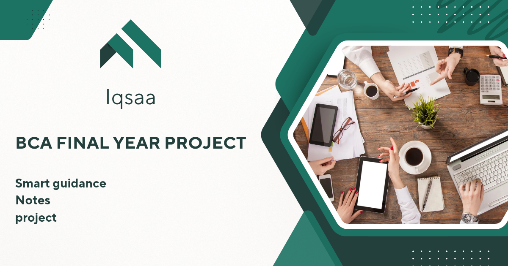

# 📘 Iqsa – BCA Guidance Website

Welcome to **Iqsa**, a clean and useful website created to guide and help BCA students with **notes, projects, and video references**.

Developed by **Mohammed Sufiyan**  
📸 Instagram: [@sufiiyn](https://instagram.com/sufiiyn)

---

## 🔗 Live Project
👉 [Visit the Website](https://sufiiynn.github.io/iqsaa/)

---

## 📄 Website Structure

| File Name      | Purpose                            |
|----------------|-------------------------------------|
| `index.html`   | Home page                          |
| `projects.html`| Downloadable projects with preview |
| `notes.html`   | Notes and video references         |
| `style.css`    | Full site design and layout        |
| `script.js`    | Page interaction and alert message |
| `README.md`    | This documentation file            |

---

## 🎯 Objective

The goal of this project is to make learning **easier for BCA students** by sharing academic materials, interactive design, and well-organized resources – all in one place.

---

## 🛠️ Technologies Used

- HTML5
- CSS3
- JavaScript (vanilla)
- GitHub Pages for free hosting
- Canva (for banner/logo)

---

## 📥 How to Use

1. Open the website via [this link](https://sufiiynn.github.io/iqsaa/).
2. Navigate to different pages using the menu.
3. Click and download notes or projects.
4. Watch reference videos right on the website.

---

## 📷 Visual Preview

---

## 💬 Get in Touch

💡 For feedback or queries:  
📩 Contact me on Instagram – [@sufiiyn](https://instagram.com/sufiiyn)

---

> This website is part of my **BCA Final Year Mini Project** to promote guidance and help students like me. Hope it helps you too!
